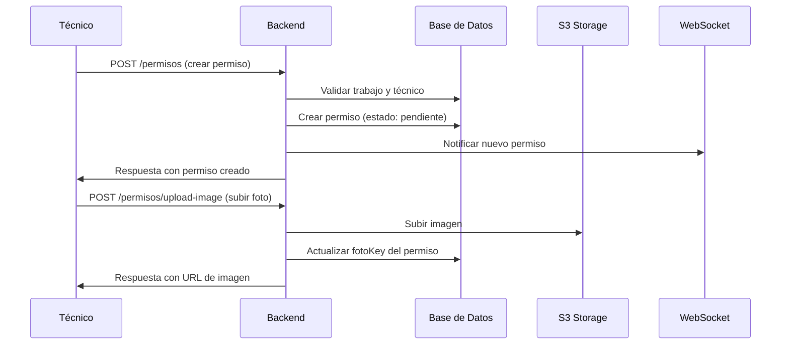
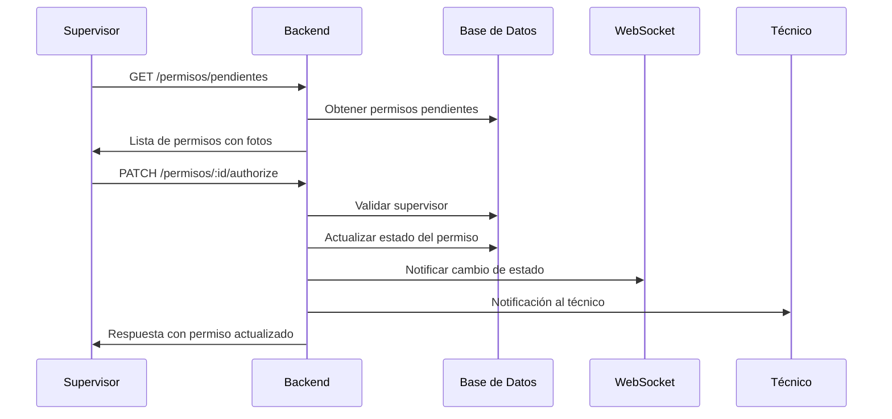

# 🔐 Flujo Completo de Permisos con Fotos - Sistema CMO

## 📋 Índice

1. [Descripción General](#descripción-general)
2. [Estados del Permiso](#estados-del-permiso)
3. [Flujo de Solicitud](#flujo-de-solicitud)
4. [Flujo de Aprobación](#flujo-de-aprobación)
5. [Endpoints y cURLs](#endpoints-y-curls)
6. [Ejemplos de Integración](#ejemplos-de-integración)
7. [Notificaciones en Tiempo Real](#notificaciones-en-tiempo-real)

---

## 🎯 Descripción General

El sistema de permisos permite a los técnicos solicitar diferentes tipos de permisos para realizar trabajos específicos. Cada permiso puede incluir fotos como evidencia y requiere la aprobación de un supervisor.

### Tipos de Permisos Disponibles

1. **ALTURA** - Para trabajos en alturas
2. **ENGANCHE** - Para trabajos de enganche
3. **CIERRE** - Para trabajos de cierre

### Secuencia de Permisos

Los permisos deben solicitarse en el siguiente orden:
1. **ALTURA** (primero)
2. **ENGANCHE** (segundo)
3. **CIERRE** (tercero)

---

## 📊 Estados del Permiso

```typescript
enum PermisoEstado {
  PENDIENTE = 'pendiente',    // Recién creado, esperando aprobación
  APROBADO = 'aprobado',      // Aprobado por supervisor
  RECHAZADO = 'rechazado'     // Rechazado por supervisor
}
```

---

## 🔄 Flujo de Solicitud

### 1. Técnico Solicita Permiso



### 2. Validaciones del Sistema

- ✅ El trabajo debe existir y no estar completado/cancelado
- ✅ El técnico debe tener rol válido
- ✅ No puede haber permisos duplicados del mismo tipo
- ✅ Los permisos deben seguir la secuencia correcta
- ✅ El primer permiso (ALTURA) cambia el estado del trabajo a "en_progreso"

---

## ✅ Flujo de Aprobación

### 1. Supervisor Revisa Permisos Pendientes



### 2. Validaciones de Aprobación

- ✅ Solo supervisores pueden aprobar/rechazar
- ✅ El permiso debe estar en estado "pendiente"
- ✅ Se registra quién autorizó y cuándo
- ✅ Se pueden agregar comentarios del supervisor

---

## 🌐 Endpoints y cURLs

### 🔐 Autenticación

```bash
# Login para obtener token
curl -X POST http://localhost:3000/auth/login \
  -H "Content-Type: application/json" \
  -d '{
    "email": "tecnico1@demo.com",
    "password": "123456"
  }'
```

### 📋 Gestión de Permisos

#### 1. Crear Permiso

```bash
# Crear nuevo permiso
curl -X POST http://localhost:3000/permisos \
  -H "Content-Type: application/json" \
  -H "Authorization: Bearer YOUR_TOKEN" \
  -d '{
    "trabajoId": "e1d68650-a7c2-435e-9623-7e4249e8f00e",
    "tecnicoId": "8476471a-4c5c-4938-9f0f-7b8ac9242b4c",
    "tipoPermisoId": "45f2674e-efdd-4e71-b727-6c6cbc4ed3eb",
    "estado": "pendiente",
    "comentariosTecnico": "Necesito acceso a áreas elevadas para realizar el mantenimiento"
  }'
```

#### 2. Subir Foto del Permiso

```bash
# Subir imagen en base64
curl -X POST http://localhost:3000/permisos/upload-image \
  -H "Content-Type: application/json" \
  -H "Authorization: Bearer YOUR_TOKEN" \
  -d '{
    "permisoId": "a1b2c3d4-e5f6-7890-1234-567890abcdef",
    "base64Data": "data:image/jpeg;base64,/9j/4AAQSkZJRgABAQAAAQABAAD..."
  }'
```

#### 3. Obtener Permisos Pendientes

```bash
# Obtener todos los permisos pendientes
curl -X GET http://localhost:3000/permisos/pendientes \
  -H "Authorization: Bearer YOUR_TOKEN"
```

#### 4. Obtener Permisos por Técnico

```bash
# Obtener permisos de un técnico específico
curl -X GET http://localhost:3000/permisos/tecnico/8476471a-4c5c-4938-9f0f-7b8ac9242b4c \
  -H "Authorization: Bearer YOUR_TOKEN"
```

#### 5. Obtener Permisos por Trabajo

```bash
# Obtener permisos de un trabajo específico
curl -X GET http://localhost:3000/permisos/by-trabajo/e1d68650-a7c2-435e-9623-7e4249e8f00e \
  -H "Authorization: Bearer YOUR_TOKEN"
```

#### 6. Obtener Permiso Específico

```bash
# Obtener un permiso por ID
curl -X GET http://localhost:3000/permisos/a1b2c3d4-e5f6-7890-1234-567890abcdef \
  -H "Authorization: Bearer YOUR_TOKEN"
```

#### 7. Aprobar/Rechazar Permiso

```bash
# Aprobar permiso
curl -X PATCH http://localhost:3000/permisos/a1b2c3d4-e5f6-7890-1234-567890abcdef/authorize \
  -H "Content-Type: application/json" \
  -H "Authorization: Bearer YOUR_TOKEN" \
  -d '{
    "estado": "aprobado",
    "supervisorId": "2879a157-654d-46ed-be30-3554a0b7a40d",
    "comentariosSupervisor": "Permiso aprobado. Asegúrate de usar el equipo de protección"
  }'

# Rechazar permiso
curl -X PATCH http://localhost:3000/permisos/a1b2c3d4-e5f6-7890-1234-567890abcdef/authorize \
  -H "Content-Type: application/json" \
  -H "Authorization: Bearer YOUR_TOKEN" \
  -d '{
    "estado": "rechazado",
    "supervisorId": "2879a157-654d-46ed-be30-3554a0b7a40d",
    "comentariosSupervisor": "Faltan puntos de anclaje verificados"
  }'
```

#### 8. Eliminar Permiso

```bash
# Eliminar un permiso
curl -X DELETE http://localhost:3000/permisos/a1b2c3d4-e5f6-7890-1234-567890abcdef \
  -H "Authorization: Bearer YOUR_TOKEN"
```

---

## 📱 Ejemplos de Integración

### React Hook para Gestión de Permisos

```typescript
// hooks/usePermisos.ts
import { useState, useEffect } from 'react';

interface Permiso {
  id: string;
  trabajoId: string;
  tecnicoId: string;
  tipoPermisoId: string;
  estado: 'pendiente' | 'aprobado' | 'rechazado';
  comentariosTecnico?: string;
  comentariosSupervisor?: string;
  fotoKey?: string;
  enviadoAt?: string;
  autorizadoAt?: string;
  autorizadoPor?: string;
  createdAt: string;
  updatedAt: string;
  trabajo?: any;
  tecnico?: any;
  supervisor?: any;
  tipoPermiso?: any;
}

export const usePermisos = () => {
  const [permisos, setPermisos] = useState<Permiso[]>([]);
  const [loading, setLoading] = useState(false);
  const [error, setError] = useState<string | null>(null);

  const API_BASE = 'http://localhost:3000';
  const token = localStorage.getItem('access_token');

  const headers = {
    'Content-Type': 'application/json',
    Authorization: `Bearer ${token}`,
  };

  // Crear permiso
  const crearPermiso = async (datos: {
    trabajoId: string;
    tecnicoId: string;
    tipoPermisoId: string;
    comentariosTecnico?: string;
  }) => {
    setLoading(true);
    setError(null);

    try {
      const response = await fetch(`${API_BASE}/permisos`, {
        method: 'POST',
        headers,
        body: JSON.stringify({
          ...datos,
          estado: 'pendiente',
        }),
      });

      if (!response.ok) {
        throw new Error('Error al crear permiso');
      }

      const nuevoPermiso = await response.json();
      setPermisos(prev => [nuevoPermiso, ...prev]);
      return nuevoPermiso;
    } catch (err) {
      setError(err instanceof Error ? err.message : 'Error desconocido');
      throw err;
    } finally {
      setLoading(false);
    }
  };

  // Subir foto
  const subirFoto = async (permisoId: string, base64Data: string) => {
    try {
      const response = await fetch(`${API_BASE}/permisos/upload-image`, {
        method: 'POST',
        headers,
        body: JSON.stringify({
          permisoId,
          base64Data,
        }),
      });

      if (!response.ok) {
        throw new Error('Error al subir imagen');
      }

      return await response.json();
    } catch (err) {
      setError(err instanceof Error ? err.message : 'Error desconocido');
      throw err;
    }
  };

  // Obtener permisos pendientes
  const obtenerPermisosPendientes = async () => {
    setLoading(true);
    setError(null);

    try {
      const response = await fetch(`${API_BASE}/permisos/pendientes`, {
        headers,
      });

      if (!response.ok) {
        throw new Error('Error al obtener permisos');
      }

      const data = await response.json();
      setPermisos(data);
    } catch (err) {
      setError(err instanceof Error ? err.message : 'Error desconocido');
    } finally {
      setLoading(false);
    }
  };

  // Autorizar permiso
  const autorizarPermiso = async (
    permisoId: string,
    datos: {
      estado: 'aprobado' | 'rechazado';
      supervisorId: string;
      comentariosSupervisor?: string;
    }
  ) => {
    setLoading(true);
    setError(null);

    try {
      const response = await fetch(`${API_BASE}/permisos/${permisoId}/authorize`, {
        method: 'PATCH',
        headers,
        body: JSON.stringify(datos),
      });

      if (!response.ok) {
        throw new Error('Error al autorizar permiso');
      }

      const permisoActualizado = await response.json();
      setPermisos(prev =>
        prev.map(p => (p.id === permisoId ? permisoActualizado : p))
      );

      return permisoActualizado;
    } catch (err) {
      setError(err instanceof Error ? err.message : 'Error desconocido');
      throw err;
    } finally {
      setLoading(false);
    }
  };

  return {
    permisos,
    loading,
    error,
    crearPermiso,
    subirFoto,
    obtenerPermisosPendientes,
    autorizarPermiso,
  };
};
```

### Componente React para Solicitud de Permisos

```tsx
// components/SolicitudPermiso.tsx
import React, { useState } from 'react';
import { usePermisos } from '../hooks/usePermisos';

interface SolicitudPermisoProps {
  trabajoId: string;
  tecnicoId: string;
  tiposPermiso: Array<{ id: string; nombre: string }>;
  onPermisoCreado?: (permiso: any) => void;
}

export const SolicitudPermiso: React.FC<SolicitudPermisoProps> = ({
  trabajoId,
  tecnicoId,
  tiposPermiso,
  onPermisoCreado,
}) => {
  const { crearPermiso, subirFoto, loading, error } = usePermisos();
  const [tipoPermisoId, setTipoPermisoId] = useState('');
  const [comentarios, setComentarios] = useState('');
  const [foto, setFoto] = useState<File | null>(null);
  const [fotoPreview, setFotoPreview] = useState<string>('');

  const handleFotoChange = (event: React.ChangeEvent<HTMLInputElement>) => {
    const file = event.target.files?.[0];
    if (file) {
      setFoto(file);
      const reader = new FileReader();
      reader.onload = (e) => {
        setFotoPreview(e.target?.result as string);
      };
      reader.readAsDataURL(file);
    }
  };

  const handleSubmit = async (event: React.FormEvent) => {
    event.preventDefault();

    try {
      // Crear permiso
      const permiso = await crearPermiso({
        trabajoId,
        tecnicoId,
        tipoPermisoId,
        comentariosTecnico: comentarios,
      });

      // Subir foto si existe
      if (foto && fotoPreview) {
        await subirFoto(permiso.id, fotoPreview);
      }

      // Limpiar formulario
      setTipoPermisoId('');
      setComentarios('');
      setFoto(null);
      setFotoPreview('');

      onPermisoCreado?.(permiso);
    } catch (err) {
      console.error('Error al crear permiso:', err);
    }
  };

  return (
    <div className="solicitud-permiso">
      <h3>📋 Solicitar Permiso</h3>
      
      {error && (
        <div className="error-message">
          ❌ {error}
        </div>
      )}

      <form onSubmit={handleSubmit}>
        <div className="form-group">
          <label htmlFor="tipoPermiso">Tipo de Permiso:</label>
          <select
            id="tipoPermiso"
            value={tipoPermisoId}
            onChange={(e) => setTipoPermisoId(e.target.value)}
            required
          >
            <option value="">Selecciona un tipo</option>
            {tiposPermiso.map((tipo) => (
              <option key={tipo.id} value={tipo.id}>
                {tipo.nombre}
              </option>
            ))}
          </select>
        </div>

        <div className="form-group">
          <label htmlFor="comentarios">Comentarios:</label>
          <textarea
            id="comentarios"
            value={comentarios}
            onChange={(e) => setComentarios(e.target.value)}
            placeholder="Describe el motivo del permiso..."
            rows={3}
          />
        </div>

        <div className="form-group">
          <label htmlFor="foto">Foto (opcional):</label>
          <input
            type="file"
            id="foto"
            accept="image/*"
            onChange={handleFotoChange}
          />
          {fotoPreview && (
            <div className="foto-preview">
              
            </div>
          )}
        </div>

        <button type="submit" disabled={loading}>
          {loading ? '⏳ Creando...' : '✅ Crear Permiso'}
        </button>
      </form>
    </div>
  );
};
```

### Componente React para Aprobación de Permisos

```tsx
// components/AprobacionPermisos.tsx
import React, { useEffect } from 'react';
import { usePermisos } from '../hooks/usePermisos';

interface AprobacionPermisosProps {
  supervisorId: string;
}

export const AprobacionPermisos: React.FC<AprobacionPermisosProps> = ({
  supervisorId,
}) => {
  const { permisos, loading, error, obtenerPermisosPendientes, autorizarPermiso } = usePermisos();

  useEffect(() => {
    obtenerPermisosPendientes();
  }, []);

  const handleAutorizar = async (permisoId: string, estado: 'aprobado' | 'rechazado', comentarios: string) => {
    try {
      await autorizarPermiso(permisoId, {
        estado,
        supervisorId,
        comentariosSupervisor: comentarios,
      });
      
      // Recargar permisos pendientes
      obtenerPermisosPendientes();
    } catch (err) {
      console.error('Error al autorizar:', err);
    }
  };

  if (loading) return <div>⏳ Cargando permisos...</div>;
  if (error) return <div>❌ Error: {error}</div>;

  return (
    <div className="aprobacion-permisos">
      <h3>🔍 Permisos Pendientes de Aprobación</h3>
      
      {permisos.length === 0 ? (
        <p>No hay permisos pendientes de aprobación</p>
      ) : (
        <div className="permisos-list">
          {permisos.map((permiso) => (
            <div key={permiso.id} className="permiso-card">
              <div className="permiso-header">
                <h4>Permiso de {permiso.tipoPermiso?.nombre}</h4>
                <span className={`estado ${permiso.estado}`}>
                  {permiso.estado.toUpperCase()}
                </span>
              </div>
              
              <div className="permiso-details">
                <p><strong>Trabajo:</strong> {permiso.trabajo?.titulo}</p>
                <p><strong>Técnico:</strong> {permiso.tecnico?.nombre}</p>
                <p><strong>Fecha:</strong> {new Date(permiso.enviadoAt || permiso.createdAt).toLocaleString()}</p>
                
                {permiso.comentariosTecnico && (
                  <p><strong>Comentarios:</strong> {permiso.comentariosTecnico}</p>
                )}
              </div>

              {permiso.fotoKey && (
                <div className="permiso-foto">
                  
                </div>
              )}

              <div className="permiso-actions">
                <button
                  onClick={() => handleAutorizar(permiso.id, 'aprobado', '')}
                  className="btn-aprobar"
                >
                  ✅ Aprobar
                </button>
                <button
                  onClick={() => {
                    const comentarios = prompt('Comentarios de rechazo:');
                    if (comentarios !== null) {
                      handleAutorizar(permiso.id, 'rechazado', comentarios);
                    }
                  }}
                  className="btn-rechazar"
                >
                  ❌ Rechazar
                </button>
              </div>
            </div>
          ))}
        </div>
      )}
    </div>
  );
};
```

---

## 🔔 Notificaciones en Tiempo Real

El sistema utiliza WebSockets para notificaciones en tiempo real:

### Conexión WebSocket

```typescript
// hooks/useWebSocket.ts
import { useEffect, useRef } from 'react';

export const useWebSocket = (url: string, onMessage: (data: any) => void) => {
  const ws = useRef<WebSocket | null>(null);

  useEffect(() => {
    ws.current = new WebSocket(url);

    ws.current.onopen = () => {
      console.log('WebSocket conectado');
    };

    ws.current.onmessage = (event) => {
      const data = JSON.parse(event.data);
      onMessage(data);
    };

    ws.current.onerror = (error) => {
      console.error('WebSocket error:', error);
    };

    ws.current.onclose = () => {
      console.log('WebSocket desconectado');
    };

    return () => {
      ws.current?.close();
    };
  }, [url, onMessage]);

  return ws.current;
};
```

### Uso en Componentes

```tsx
// En el componente de permisos
const { permisos, obtenerPermisosPendientes } = usePermisos();

useWebSocket('ws://localhost:3000', (data) => {
  if (data.type === 'permiso_notification') {
    // Recargar permisos cuando hay cambios
    obtenerPermisosPendientes();
  }
});
```

---

## 📊 Códigos de Respuesta

| Código | Descripción |
|--------|-------------|
| 200 | ✅ Operación exitosa |
| 201 | ✅ Recurso creado exitosamente |
| 400 | ❌ Datos inválidos o error de validación |
| 401 | ❌ No autorizado - Token requerido |
| 403 | ❌ Prohibido - Rol insuficiente |
| 404 | ❌ Recurso no encontrado |
| 500 | ❌ Error interno del servidor |

---

## 🔧 Configuración de Postman

### Variables de Entorno

```json
{
  "base_url": "http://localhost:3000",
  "token": "{{access_token}}",
  "tecnico_id": "8476471a-4c5c-4938-9f0f-7b8ac9242b4c",
  "supervisor_id": "2879a157-654d-46ed-be30-3554a0b7a40d",
  "trabajo_id": "e1d68650-a7c2-435e-9623-7e4249e8f00e",
  "tipo_permiso_altura": "45f2674e-efdd-4e71-b727-6c6cbc4ed3eb",
  "tipo_permiso_enganche": "6e680ae5-97d6-4944-86a1-7d2e5c36d05e",
  "tipo_permiso_cierre": "f4d943b0-82c2-4a81-abeb-64bf6fca1ddd"
}
```

### Headers Globales

```
Content-Type: application/json
Authorization: Bearer {{token}}
```

---

## 🎯 Flujo Completo de Ejemplo

1. **Login Técnico** → Obtener token
2. **Crear Permiso ALTURA** → Estado: pendiente
3. **Subir Foto** → Evidencia visual
4. **Login Supervisor** → Obtener token
5. **Ver Permisos Pendientes** → Lista de permisos
6. **Aprobar Permiso** → Estado: aprobado
7. **Crear Permiso ENGANCHE** → Siguiente en secuencia
8. **Repetir proceso** → Hasta completar todos los permisos

Este flujo garantiza que los permisos se soliciten en el orden correcto y que cada uno tenga la aprobación necesaria del supervisor antes de continuar con el siguiente. 